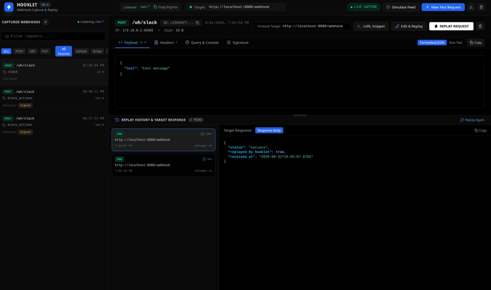
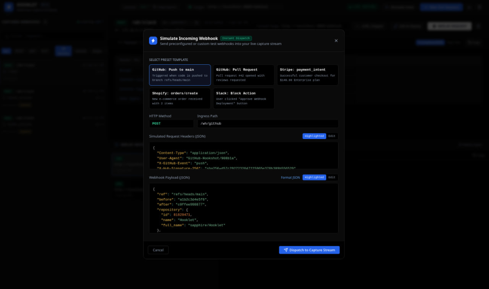
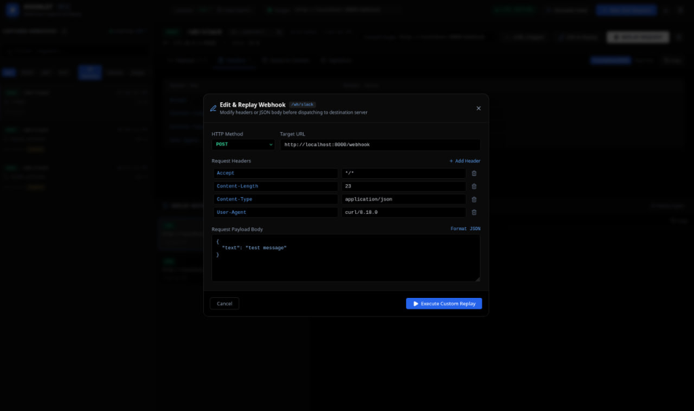
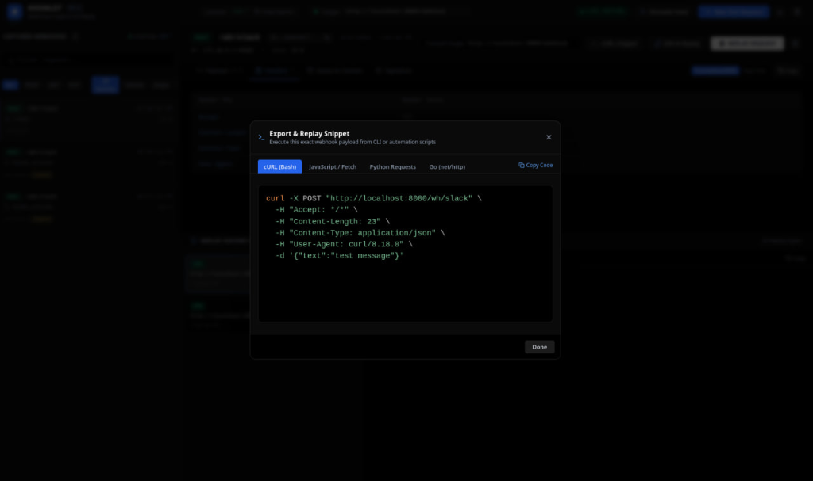

# Hooklet

Hooklet is a self-hosted webhook capture, inspection, and replay engine. It allows developers to capture incoming webhooks locally, inspect raw payloads and cryptographic signatures, modify requests on the fly, and replay them directly to local backend applications.

Built with Go, embedded SQLite, and a responsive web dashboard, Hooklet operates as a single static binary with zero external runtime dependencies.



## Why Hooklet?

When developing applications that consume webhooks (from services such as Stripe, GitHub, Shopify, Slack, or Twilio), developers typically face several challenges:

- **Third-party cloud dependencies**: Relying on external inspection tools exposes sensitive client payloads to third-party servers.
- **Lost raw byte accuracy**: Formatted JSON proxies alter whitespace and byte ordering, invalidating HMAC cryptographic signature verification (such as Stripe-Signature or X-Hub-Signature-256).
- **Repetitive manual triggers**: Triggering real webhooks repeatedly from provider dashboards slows down iteration cycles.
- **Network namespace isolation**: Running inspection tools inside containers often complicates forwarding requests back to host development services.

Hooklet addresses these problems by running completely on your local machine or private infrastructure, preserving exact raw request bytes, and providing an interactive replay interface.

---

## Screenshots

### Main Dashboard and Live Inspector
Inspect captured webhooks in real time with headers, query parameters, detected signatures, raw payload view, and an interactive resizable split pane for replay run history and target server responses.


### Built-in Webhook Simulator
Generate and dispatch pre-configured, real-world webhook events (GitHub pushes, pull requests, Stripe payments, Shopify orders, Slack block actions) or customize your own test payloads without needing live provider accounts.



### Edit and Replay Modal
Modify HTTP headers and payload bodies directly before replaying them to destination endpoints, allowing you to test edge cases, missing fields, or invalid authentication signatures.



### Code Export and Snippets
Export any captured webhook into clean, ready-to-run code snippets for cURL (Bash), JavaScript (Fetch), Python (Requests), and Go (net/http) with full syntax highlighting and one-click clipboard copying.



---

## Core Features

- **Byte-Accurate Ingress Capture (`/wh/*`)**: Preserves exact incoming payload bytes so HMAC-SHA256 signatures match perfectly.
- **Embedded Storage**: Uses pure Go SQLite (modernc.org/sqlite) with zero CGO requirements. Everything is stored locally in a single file database.
- **Real-Time Streaming (SSE)**: New webhooks stream directly into the browser dashboard via Server-Sent Events without polling.
- **One-Click Replay Engine**: Forwards stored webhooks to your target server (e.g., `http://localhost:8000/webhook`) and records the destination status code, latency, and response body.
- **Automatic Docker Host Loopback Resolution**: When running Hooklet in a Docker container, requests targeted at `localhost` or `127.0.0.1` are automatically resolved to `host.docker.internal` so host services can be reached without configuration friction.
- **Interactive Two-Way Split Pane**: Resizable split pane smoothly balances space between the payload inspector and replay run history without causing page-level scrolling.
- **Preset Simulation Sandbox**: Built-in test payloads for common providers allow offline testing on airplanes or without an active internet connection.
- **Code Export**: Instantly generate runnable code in cURL, JavaScript, Python, and Go for any captured webhook.
- **Selective Deletion**: Delete individual webhooks with one click from card hover controls or clean the database using a confirmation dialog.
- **Pure Dark Mode Theme**: High-contrast OLED interface with pure black backgrounds, syntax-colored JSON tokens, and Lucide SVG icons.

---

## Getting Started

### Option 1: Docker Compose (Recommended)

The fastest way to run Hooklet with persistent storage is using Docker Compose:

```bash
docker compose up -d
```

Open your browser at `http://localhost:8080`.

To stop the container:
```bash
docker compose down
```

### Option 2: Precompiled Go Binary

If you have Go installed (version 1.24 or later):

1. Clone the repository:
   ```bash
   git clone https://github.com/ruhamabek/Hooklet.git
   cd Hooklet
   ```

2. Build the binary:
   ```bash
   go build -o hooklet ./cmd/hooklet
   ```

3. Run Hooklet:
   ```bash
   ./hooklet
   ```

By default, the server starts on port `8080` with a forward target of `http://localhost:8000`.

---

## Testing with the Included Companion Receiver

Hooklet includes a companion Node.js receiver in `examples/node_receiver/server.js` designed for testing:

1. Start the companion server in a separate terminal:
   ```bash
   node examples/node_receiver/server.js
   ```
   The companion receiver listens on `http://localhost:8000`.

2. Open the Hooklet dashboard at `http://localhost:8080`.

3. Click **Simulate Feed**, choose a template (e.g., GitHub or Stripe), and click **Dispatch to Capture Stream**.

4. Select the captured webhook and click **REPLAY REQUEST**.

5. Observe the `200 OK` status and the receiver response logged in both the Hooklet inspector and your Node.js terminal.

---

## Receiving Webhooks from the Public Internet

To capture live webhooks from external providers (such as Stripe or GitHub webhooks in production or staging), forward traffic to Hooklet using a local tunnel:

### Using Cloudflare Tunnels
```bash
cloudflared tunnel --url http://localhost:8080
```

### Using ngrok
```bash
ngrok http 8080
```

Copy the generated public HTTPS URL (e.g., `https://your-subdomain.ngrok-free.app/wh/stripe`) and enter it into your provider webhook settings. All incoming requests will appear live in your Hooklet dashboard.

---

## Configuration

Hooklet can be configured via command-line flags or environment variables:

| Flag | Environment Variable | Default | Description |
| :--- | :--- | :--- | :--- |
| `-port` | `PORT` | `8080` | HTTP port for dashboard and webhook ingress |
| `-target` | `HOOKLET_TARGET` | `http://localhost:8000` | Default destination endpoint for replaying webhooks |
| `-db` | `HOOKLET_DB` | `hooklet.db` | Path to SQLite database file |

### Example CLI Usage
```bash
./hooklet -port 9090 -target http://localhost:3000/api/webhooks -db ./data/custom.db
```

### Example Environment Variables Usage
```bash
PORT=9090 HOOKLET_TARGET=http://localhost:3000/api/webhooks ./hooklet
```

---

## API Reference

Hooklet exposes a clean REST API:

### Webhook Ingress
- `POST /wh/*`, `GET /wh/*`, `PUT /wh/*`, `DELETE /wh/*`
  - Captures the incoming request, stores raw headers and bytes, and broadcasts to live clients over SSE.

### Requests API
- `GET /api/requests`
  - Returns captured webhooks in reverse chronological order. Supports `?limit=N` and `?offset=N`.
- `GET /api/requests/{id}`
  - Returns complete details for a single captured webhook including headers, query params, and replay history.
- `DELETE /api/requests/{id}`
  - Permanently deletes a single webhook and its associated replay attempts.
- `DELETE /api/requests`
  - Clears all captured webhooks and replay attempts from the database.

### Replay API
- `POST /api/requests/{id}/replay`
  - Replays the webhook to the configured target or custom URL provided in the request body:
    ```json
    {
      "target": "http://localhost:8000/webhook",
      "method": "POST",
      "headers": {
        "Content-Type": "application/json"
      },
      "body": "{\"custom\":\"data\"}"
    }
    ```

### Events Stream
- `GET /api/events`
  - Server-Sent Events (SSE) stream broadcasting live `webhook_captured` events to connected dashboards.

---

## Project Structure

```
Hooklet/
├── cmd/
│   └── hooklet/
│       └── main.go              # Application entrypoint and CLI flag parsing
├── internal/
│   ├── capture/                 # Webhook ingestion HTTP handler
│   ├── event/                   # Thread-safe SSE broker and event distributor
│   ├── model/                   # Data models for requests and replay attempts
│   ├── replay/                  # HTTP replay dispatcher and host resolution
│   ├── server/                  # Server routing, REST endpoints, and SSE handler
│   └── store/                   # SQLite storage implementation (modernc.org/sqlite)
├── web/
│   ├── templates/               # Go HTML template components
│   │   ├── components/          # Modular partials (header, sidebar, inspector, replays)
│   │   ├── modals/              # Interactive dialogs (simulate, snippet, edit, clear)
│   │   └── index.html           # Master layout
│   ├── static/                  # Static assets (CSS, JS, highlighting)
│   └── web.go                   # Go embed.FS filesystem wrapper
├── examples/
│   └── node_receiver/           # Companion Node.js receiver for testing
├── Dockerfile                   # Multi-stage zero-CGO container build
├── docker-compose.yml           # Compose specification with volume and host gateway
└── README.md                    # Project documentation
```

---

## Testing

Run the test suite across all internal packages:

```bash
go test ./...
```

---

## License

MIT License. Feel free to use, modify, and distribute Hooklet for personal and commercial projects.
